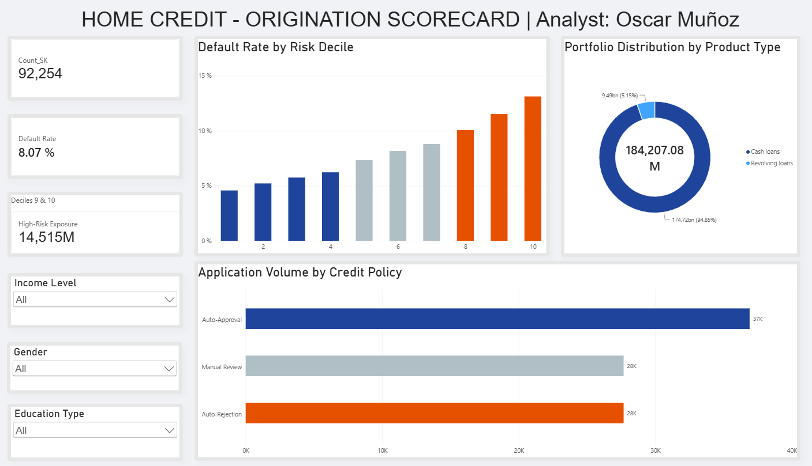

# Credit Risk Scorecard & Default Prediction Model

## Project Overview
This project was made with the objective to create a robust Credit Risk Scorecard to predict the probability of default for consumer loans. It was built using the Home Credit Default Risk dataset from Kaggle, the model demonstrates the end to end process of credit risk analytics; from data preprocessing and logistic regression modeling in Python, to generate a decil validation in Excel, and finally realized an executive visualization in Power BI. 

## Tools
**Python** Pandas, Numpy, Scipy, Scikit-learn (Logistic Regression and Data Wrangling).
**Microsoft Excel** Decile validation, Bad Rate calculation, Risk Decile binning.

## Repository Structure
'notebook/': Contains the Jupyter Notebook with Feature Engineering, EDA, and the Logistic Regression model.
'validation/': Excel file containing the model´s decile validation and risk categories.
'dashboard/': Power BI dashboard screenshot and file.

## Executive Dashboard

## Phase 2 - Work in Progress
* Integrate exxternal transactional data (Bureau and Previous Applications) to improve the predictive power through feature engineering.
* Develop a challenger model comparing the original Logistic Regression against advanced tree-based algorithms.
